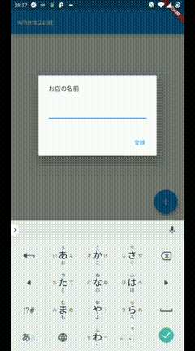
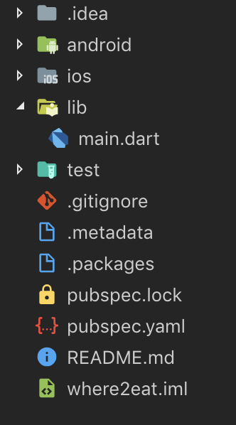
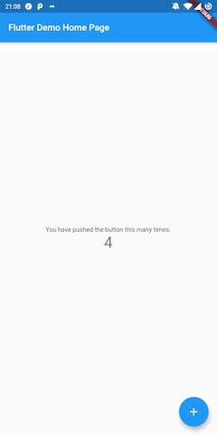
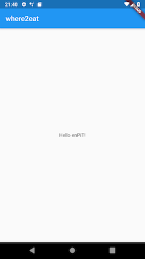

# Flutterでenpitチュートリアル

このチュートリアルは、enpit公式のチュートリアルをFlutterで置き換えるものです。

## 事前準備 - Flutterの環境構築

~~[こちら](./flutter_install.md)で解説したので各自で準備してください。~~

書いてる余裕が無かったので[公式ガイド](https://flutter.dev/docs/get-started/install)を参照してください。非常に分かりやすいので、言われるがままにやっていけば全く問題ありません。

## 何をやるのか
- FlutterというGoogleが開発したフレームワークを用いて、AndroidとiOSの両方に対応した簡単なアプリを作っていきます。
- **【対象】** Flutter初心者。enPiTのRailsチュートリアルと同じ速度で進めることを想定しています。

## お題(enPiT公式スライドより)
- 対象ユーザ
  - 筑波学園都市在住、外食派
  - 優柔不断でいつも昼食にどこ行くか迷う
- ユーザが現在抱えている問題
  - 学食がイマイチなので外で食べたい
  - たまになら学食に行っても良いが、毎日は嫌だ
- **【アプローチ】** とにかく手っ取り早く「ここに行け」と断言する

## 実現したいこと(enPiT公式スライドより)
- とにかく何かおすすめしてくれる
- ランダムにおすすめしてくれる

(以降は本日の範囲外なので省略)

## 動かせるアプリを作ります
- PCとAndroid/iOSを繋ぐケーブルがあれば実機で動作します
- 以下のようなアプリを作っていきます。



## きょうやること
- とにかく何かおすすめしてくれる

## とにかく何かおすすめしてくれる


まずは画面の中央に文字を掲出することを考えます。

## 本日の技術的な内容

- Flutterでプロジェクトを作る
- ディレクトリ構成を作る
- とりあえず起動してみる
  - この時点で既に動作します
- Widgetの基本を理解する
<!-- - SQLite(アプリケーションDB)の設定をする
  - 使用するのは次回です(たぶん) -->
- GitHubにレポジトリを作ってアップロード

## Flutterプロジェクトを作ろう
まずは、何はともあれ以下のコマンドをターミナルに入力してみましょう。

```bash
$ flutter create where2eat
```

`where2eat` はプロジェクト名です。別の名前でもOKです。

## Flutterアプリの構成概要

## 作られたプロジェクトを見る

Flutterによって作られたプロジェクトは、概ね以下のようになっていると思います。



主要な機能は `lib` 配下に書いていきます。

`lib`配下には初期状態では `main.dart` のみが配置されています。Railsと違い、自動的に何でもかんでも生成してくれるわけではありません。

他のディレクトリについても軽く説明しておきます。

- `.idea`
  - IntelliJ IDEAやAndroid Studioといった高機能エディタ向けの設定ファイルです。基本的に手作業でいじる必要はありません。
- `android`・`ios`
  - Android専用のコード、iOS専用のコードはこのディレクトリ配下に設置します。GPSや指紋認証を使う場合、それぞれのOSに特化したコードを書く必要があります。
  - 今回の開発では初期状態のまま放置しますが、削除してはいけません。
- `test`
  - テスト(プログラムが正しく動作しているか確認する作業)する際のコードを配置するディレクトリです。
  - 今回は使用しません。
- `pubspec.yaml`
  - インストールするライブラリやプロジェクト全体の設定ファイルです。手で編集します。
- `pubspec.lock`・`.packages`
  - 実際にインストールしたライブラリなどの情報が書かれたファイルです。`pubspec.yaml`に基づいて自動生成されます。基本的に手で編集することはありません。
- `.gitignore`
  - gitの管轄下から除外するファイルやディレクトリを設定するファイルです。
  - Flutterに限らず、何の開発でも使用します。

## アプリケーションを起動する

PCにAndroidかiOSの端末を接続するか、エミュレータを起動しておきます。以下のコマンドを打ち、接続の状態を確認します。

```bash
$ flutter devices
```

僕の手元では以下のような結果が返ってきました。

```
2 connected devices:

ONEPLUS A5010             • 63766f0       • android-arm64 • Android 9 (API 28)
Android SDK built for x86 • emulator-5554 • android-x86   • Android 9 (API 28) (emulator)
```

もし何も返ってこない場合、上手く接続できていない可能性があります。Flutterのインストール手順などももう一度確認してください。

アプリケーションを起動します。以下のコマンドを入力してください。`63766f0`は僕の環境での数字ですので真似してはいけません。先ほど実行した`flutter devices`コマンドの結果から自分に合ったものを探してください。

```bash
$ flutter run -d 63766f0
```

正しくアプリケーションが起動できればこのような画面になります。



ここまでできればとりあえずOKです。

## Git関連の話
完全にenPiT公式と同じ話になってしまうので、enPiT公式スライドを参照してください。

スライドの24ページから40ページまではenPiT公式の内容と全く同じです。

## まずは書いてみる

まずは `lib/main.dart` の28行目付近にある

```dart
class MyHomePage extends StatefulWidget {
```

から最後までをすべて削除します。また、23行目の `title: 'Flutter Demo Home Page'` も削除してください。ついでに、コメントも削除してしまいましょう。

ファイル全体で以下のようになります。

```dart
import 'package:flutter/material.dart';

void main() => runApp(MyApp());

class MyApp extends StatelessWidget {
  @override
  Widget build(BuildContext context) {
    return MaterialApp(
      title: 'Flutter Demo',
      theme: ThemeData(
        primarySwatch: Colors.blue,
      ),
      home: MyHomePage(),
    );
  }
}
```

とってもシンプルになりました。13行目の `MyHomePage()` にエラーが付いていれば正解です。

エラーを消すため、`MyHomePage`クラスを実装してみましょう。

先ほどから編集している `lib/main.dart` の末尾に以下のテキストを付け加えます。

```dart
class MyHomePage extends StatelessWidget {
  @override
  Widget build(BuildContext context) {
    return Scaffold(
      appBar: AppBar(
        title: Text('where2eat'),
      ),
      body: Center(
        child: Text('Hello enPiT!'),
      ),
    );
  }
}
```

`flutter run` してみると、以下のように画面が変わります。



## コード解説

今回書いたコードを見てみましょう。

`MyHomePage`クラスは、`Widget`型を返すメソッド`build`を持っています。`build`メソッドで返す`Widget`は、`MyHomePage`のウィジェットと考えることができます。何を言っているのか分からないでしょうが、とりあえず言葉だけ追っておけばOKです。

`build`メソッドでは、`Scaffold`を返しているのが見えるはずです。この`Scaffold`はウィジェットの一種です。`Scaffold`は`appBar`と`body`を持っていて、それぞれに`AppBar`と`Center`が設定されています。`AppBar`や`Center`もウィジェットです。

ウィジェットだらけですね。**Flutterではウィジェットを組み合わせることでアプリケーションを組み立てていきます。** ウィジェットは、HTMLで言えば `<hoge></hoge>` といったタグに相当します。今の状態を無理やりHTML的に表すなら次のようになります。

```html
<Scaffold>
    <AppBar>
        <Text>wheere2eat</Text>
    </AppBar>
    <Center>
        <Text>Hello enPiT!</Text>
    <Center>
</Scaffold>
```

かなり無理がある説明ですが、雰囲気を掴んでいただければ幸いです。

それぞれのウィジェットについて解説していきます。

- `Scaffold`
  - アプリケーションの画面全体を簡単に生成するウィジェットです。
  - `appBar`には`AppBar`を設定します。
  - `body`にはアプリケーションの本体部分を設定します。あらゆるウィジェットを設定可能です。
- `AppBar`
  - アプリケーション上部のバーを意味するウィジェットです。
  - `title`に`Text`を設定すると、バーに文字を出すことができます。
- `Text`
  - 文字を表示するウィジェットです。
- `Center`
  - `child`に設定したウィジェットを上下左右の中央に表示するウィジェットです。

ところで、

```dart
hoge(nam1: val1, nam2: val2)
```

という書き方が随所に見られます。Dartには「名前付き引数」という概念があり、これはそれに該当します。Rubyを習っている人なら馴染みがあるかもしれません。通常、JavaやCでは引数を設定した位置によって引数の意味を決めます。ところがDartでは、引数に名前を付け、その名前で引数を管理することが可能です。

例えば先ほどの例では、`hoge`メソッドは以下のように実装できます。

```dart
void hoge({nam1, nam2}) {
    print(nam1);
    print(nam2);
}
```

`nam1`には`val1`が、`nam2`には`val2`が入ってきます。

ここまででFlutterの雰囲気は掴んでいただけたはずです(強引)。


## 本日のゴール

さて、本日の課題は「画面中央に開発者が設定した固定値を表示する」ことでした。

ここまで作成してきたアプリケーションを書き換え、画面中央に好きな文字を表示してみましょう。

#### Tips1：文字サイズの設定
文字が小さい？もう一工夫して文字サイズを拡大してみましょう。

`Text()`は、「名前付き引数」(先ほど説明しましたね！)に`style`を設定可能です。`style`には`TextStyle()`を渡すことができます。

さらに、`TextStyle()`には名前付き引数で`fontSize`を設定できます。`fontSize`には数字を渡してあげましょう。

<div style="height:3em"></div>
……できましたか？以下に設定例を示しておきます。

```dart
Text(
    'Hello enPiT!',
    style: TextStyle(fontSize: 30),
),
```

## 最後に

ここまでの編集内容をGitHubにpushしておきましょう。コードをシェアする目的だけでなく、バックアップにもなります。

## 筆者の嘆き

本当はモバイル端末内で動作するデータベースの設定までやりたかったけど筆者の集中力が限界でした。ごめんなさい。


<!-- 
## 現在の状況を確かめる

`lib/main.dart` を見てみましょう。

いくつかクラスが定義されているのが分かります。Flutterでは、クラスを組み合わせてアプリケーションを構築していきます。

順に解説していきます。

### `MyApp`

```dart
class MyApp extends StatelessWidget 
```

このクラスは全体の基幹となっているクラスです。これから作るものはすべてこのクラスの配下に置かれます。`StatelessWidget`を継承しています。これについては後ほど解説します。

### `MyHomePage`

```dart
class MyHomePage extends StatefulWidget
```

ホームのページを作っているクラスです。先ほどと異なり、`StatefulWidget`を継承しています。


### `_MyHomePageState`

```dart
class _MyHomePageState extends State<MyHomePage>
```

ホームのページのステート(状態)を管理しているクラスです。`State<MyHomePage>`を継承しています。クラス名が `_` で始まっています。このようなクラスは、同一ファイル内でしか使用することができません。 -->
